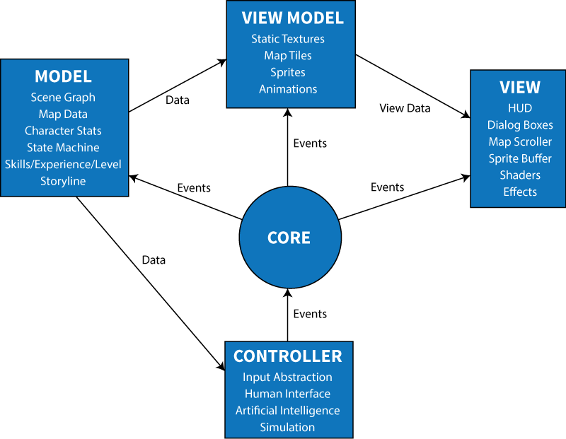

## Architecture Overview
This document gives a basic overview of the architectual concepts that are used in project "Phoenix."

### MVVCCM
Got kind of crazy with the acronyms on this one. Basically, it's describing the basic arrangement of the components that make up phoenix. The letters stand for:

- **M**odel
- **V**iew
- **V**iew **M**odel
- **C**ore
- **C**ontroller

The **Model** is the basis of the game, it's a collection of all the code components and data that make up the game logic, statistics, data, and anything that really makes the game a game and not a fancy technology demo. The **View** is kind of a misnomer, because it contains not only the components that make up what _you_ see but also what you hear and any debugging tools that display internal data for testing purposes. The **View Model** serves as the glue code between the **Model** and **View**. Simply put, its purpose is to take game data and relate it to any audio/video assets that may be displayed on screen. For example, the **View Model** is responsible for providing animation frames, sprites, terrain tiles, and other similar things to the **View**.  The **Core** serves as the connection between everything **Model**, **View**, and **Controller** by providing the event propagation service as well as the component loader, environment abstractions, and more. The **Controller** serves as the brain of phoenix. It contains all the code to handle mapping input from a human to events that happen in a game, all the code to handle the game simulation itself (stuff that happens without human interaction), and all the code for any artificial intelligence.

Here's a diagram showing their interactions:

See my article about the core architecture [here](post/game-core-architecture) for more information.
